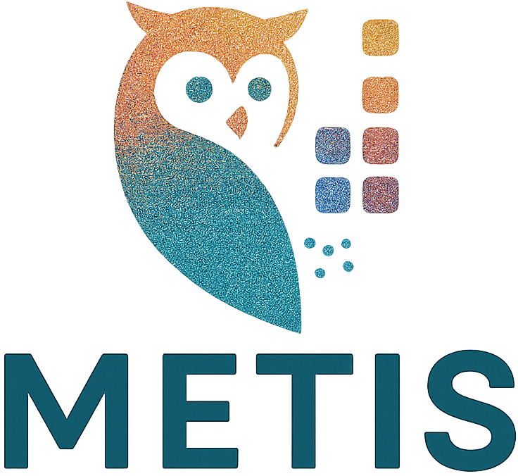

<div align="center">

</div>

## **M**olecular **E**xploration and **T**ranscriptomic **I**nvestigation **S**uite

METIS is a comprehensive bioinformatics web application suite built with Streamlit for RNA-seq analyses, single-cell RNA-seq analyses, ChIP-seq and CUT&RUN-seq analyses, and various data manipulation tasks. This toolkit provides an intuitive interface for researchers to perform complex genomic analyses without requiring extensive programming knowledge.

## 🚀 Quick Start

### Installation

1. Clone this repository:
```bash
git clone https://github.com/yourusername/metis.git
cd metis
```

2. Install required packages:
```bash
pip install -r requirements.txt
```

3. Run the main application:
```bash
streamlit run metis.py
```

## 📋 Required Packages

### Core Dependencies
- **streamlit** - Web application framework
- **pandas** - Data manipulation and analysis
- **numpy** - Numerical computing
- **matplotlib** - Plotting library
- **seaborn** - Statistical data visualization
- **plotly** - Interactive plotting
- **scipy** - Scientific computing

### Bioinformatics Libraries
- **scanpy** - Single-cell analysis
- **anndata** - Annotated data structures
- **pyscenic** - Gene regulatory network analysis
- **decoupler** - Pathway activity inference
- **GSEApy** - Gene Set Enrichment Analysis
- **PyWGCNA** - Weighted Gene Co-expression Network Analysis
- **liana** - Ligand-receptor analysis
- **cellchat** - Cell communication analysis

### R Integration
- **rpy2** - R interface for Python
- **R packages**: DESeq2, edgeR, limma, WGCNA, Combat-seq, impulseDE2, Mfuzz

### File Processing
- **openpyxl** - Excel file handling
- **h5py** - HDF5 file format
- **pysam** - SAM/BAM file processing
- **pybedtools** - BED file manipulation

## 📊 Available Applications Overview

METIS includes **67 specialized applications** organized into 9 functional categories:

| Category | Apps | Primary Functions |
|----------|------|-------------------|
| **📝 Data Normalization/Manipulation** | 7 apps | Raw data processing, format conversion, table manipulation |
| **🔁 Gene Name Conversion** | 5 apps | ID mapping, symbol updates, cross-species conversion |
| **🧮 Data Analysis** | 12 apps | Differential expression, statistical testing, batch correction |
| **🌋 Data Visualization** | 5 apps | PCA, volcano plots, heatmaps, box plots, Venn diagrams |
| **🔀 Pathway Analysis** | 3 apps | Gene set enrichment, pathway activity, protein interactions |
| **🥅 WGCNA** | 5 apps | Co-expression networks, module detection, hub analysis |
| **🎡 scRNA-seq** | 11 apps | Single-cell analysis, pseudobulk, metacells, SCENIC |
| **💬 Cell Communication** | 6 apps | Ligand-receptor analysis, CellChat, intercellular signaling |
| **🧬 ChIP-seq** | 11 apps | Peak calling, annotation, BAM processing, quality control |
| **Ⓜ Miscellaneous** | 3 apps | File operations, data cleaning, utility functions |

## 📝 Data Normalization/Manipulation

| Tool | Features & Parameters | Input/Output |
|------|---------------------|--------------|
| **Count Data Normalization** | RNA-seq count normalization and QC with multiple methods | Input: Raw count matrix<br>Output: Normalized data, QC plots |
| **Homer or DESeq2 to Data** | Extract clean data from Homer/DESeq2 results | Input: Homer/DESeq2 files<br>Output: Clean data matrices |
| **Count to TPM** | Convert raw counts to TPM normalization | Input: Count matrix + lengths<br>Output: TPM normalized data |
| **Manipulate Data Table** | Data table manipulation and restructuring | Input: Any tabular data<br>Output: Processed data table |
| **Merge Data Files** | Combine multiple data files | Input: Multiple data files<br>Output: Merged dataset |
| **Filter and Transform Data** | Data filtering and mathematical transformations | Input: Expression matrix<br>Output: Filtered/transformed data |
| **Spread Sheet** | Interactive data editing interface | Input: Various formats<br>Output: Edited data files |

## 🔁 Gene Name Conversion

| Tool | Features & Parameters | Input/Output |
|------|---------------------|--------------|
| **Update Gene Symbol** | Update gene symbols to latest HGNC/MGI standards | Input: Homer files, TSV with symbols<br>Output: Updated symbol files |
| **Gene Symbol to Ensembl ID** | Convert gene symbols to Ensembl IDs | Input: Symbol lists, Homer files<br>Output: Ensembl ID mappings |
| **Ensembl ID to Gene Symbol** | Convert Ensembl IDs to gene symbols | Input: Ensembl ID lists<br>Output: Symbol mappings |
| **Mouse Human Symbol Conversion** | Cross-species ortholog mapping | Input: Mouse/Human symbols<br>Output: Cross-species mappings |
| **GMT Mouse Human Conversion** | Convert gene sets between mouse and human | Input: GMT files<br>Output: Converted gene sets |

## 🧮 Data Analysis

| Tool | Features & Parameters | Input/Output |
|------|---------------------|-------------|
| **DESeq2** | Differential expression analysis with Wald test and GLM modeling | Input: Count matrix + metadata<br>Output: DE results, MA plots |
| **DESeq2-LRT** | Time course and multi-group analysis with Likelihood Ratio Test | Input: Count data + time/group info<br>Output: LRT results, time profiles |
| **edgeR** | Differential expression with exact test and quasi-likelihood methods | Input: Count matrix + design<br>Output: DE genes, dispersion plots |
| **limma** | Linear modeling for microarray and RNA-seq (voom) analysis | Input: Expression/count matrix<br>Output: Moderated statistics, p-values |
| **Batch removal by Combat-seq** | sva Combat-seq batch correction for count data | Input: Count matrix + batch info<br>Output: Batch-corrected counts |
| **Make ranking file for GSEA** | Create GSEA-compatible ranking files | Input: DE results<br>Output: Ranked gene lists (.rnk) |

## 🌋 Data Visualization

| Tool | Features & Parameters | Input/Output |
|------|---------------------|-------------|
| **PCA** | PCA, UMAP, tSNE, MDS dimensionality reduction | Input: Expression matrix<br>Output: PCA plots, coordinates |
| **Volcano plot** | Interactive volcano plots for DE results | Input: DE results<br>Output: Interactive volcano plots |
| **Heatmap** | Hierarchical clustering heatmaps | Input: Expression matrix<br>Output: Clustered heatmaps |
| **Box/Violin plot** | Box, violin, and strip plots with statistics | Input: Expression + metadata<br>Output: Statistical plots |
| **Venn/Upset Plot** | Multi-set intersection analysis | Input: Gene/feature lists<br>Output: Intersection visualizations |

## 🔀 Pathway Analysis

| Tool | Features & Parameters | Input/Output |
|------|---------------------|-------------|
| **decoupleR** | Python decoupleR pathway and TF activity inference | Input: Expression matrix + gene sets<br>Output: Activity scores, plots |
| **GSEApy** | GSEApy gene set enrichment analysis | Input: Gene lists/expression + gene sets<br>Output: Enrichment results, plots |
| **PPI analysis** | STRING-db protein-protein interaction networks | Input: Gene/protein lists<br>Output: Interaction networks, annotations |

## 🥅 WGCNA (Weighted Gene Co-expression Network Analysis)

| Tool | Features & Parameters | Input/Output |
|------|---------------------|-------------|
| **WGCNA** | PyWGCNA and R-WGCNA co-expression network analysis | Input: Expression matrix + traits<br>Output: Modules, networks, correlations |
| **WGCNA network plot** | WGCNA module network visualization | Input: WGCNA results<br>Output: Network visualizations |
| **WGCNA hub UMAP** | UMAP visualization of WGCNA module genes | Input: WGCNA modules + expression<br>Output: UMAP plots, hub gene lists |
| **WGCNA objects comparison** | Compare WGCNA modules between conditions/studies | Input: Multiple WGCNA objects<br>Output: Preservation statistics, plots |
| **Generate gmt from cluster info** | Convert clustering results to GMT gene sets | Input: Cluster assignments<br>Output: GMT gene set files |

## 🎡 Single-cell RNA-seq (scRNA-seq)

| Tool | Features & Parameters | Input/Output |
|------|---------------------|-------------|
| **Pseudobulk** | Create pseudobulk data from single-cell AnnData | Input: AnnData (h5ad)<br>Output: Pseudobulk expression matrices |
| **Metacells by SEACells** | SEACells metacell construction algorithm | Input: AnnData with embeddings<br>Output: Metacell assignments, objects |
| **Random pseudo-replicates** | Create pseudo-replicates by random cell splitting | Input: Single-cell data<br>Output: Pseudo-replicated datasets |
| **memento DE analysis** | Memento single-cell differential expression | Input: AnnData + conditions<br>Output: DE results, statistics |
| **memento 2D analysis** | Memento 2D trajectory and spatial analysis | Input: Spatial/trajectory data<br>Output: 2D analysis results |
| **SCENIC heatmap** | Visualize SCENIC regulon activity patterns | Input: SCENIC regulon activities<br>Output: Activity heatmaps |
| **Prepare regulon data for heatmap** | Prepare SCENIC results for heatmap visualization | Input: Raw SCENIC results<br>Output: Processed regulon data |
| **SCENIC CSI** | Calculate Connection Specificity Index for SCENIC regulons | Input: SCENIC network data<br>Output: CSI scores, statistics |
| **SCENIC network analysis** | SCENIC gene regulatory network visualization | Input: SCENIC regulons<br>Output: Network visualizations |
| **SCENIC multinetwork analysis** | Multi-TF regulatory network integration | Input: Multiple regulon sets<br>Output: Integrated network analysis |

## 💬 Cell Communication

| Tool | Features & Parameters | Input/Output |
|------|---------------------|-------------|
| **LIANA LR analysis** | LIANA+ ligand-receptor interaction analysis | Input: AnnData with cell types<br>Output: L-R interaction results |
| **LIANA comparison** | Compare LIANA results between conditions | Input: Multiple LIANA results<br>Output: Comparative analysis |
| **CellChat** | Python CellChat cell-cell communication analysis | Input: AnnData (h5ad)<br>Output: Communication networks, plots |
| **CellChat comparison** | Compare CellChat results between conditions | Input: Dual-condition h5ad<br>Output: Differential communication |
| **CellChat permutation test** | Statistical testing of CellChat comparisons | Input: CellChat comparison results<br>Output: Statistical significance |
| **CellChat R qs to python** | Convert SCALA CellChat results to Python format | Input: R CellChat .qs files<br>Output: Python-compatible data |


## 🧬 ChIP-seq Analysis

| Tool | Features & Parameters | Input/Output |
|------|---------------------|-------------|
| **Sort BAM file** | SAMtools coordinate-based BAM sorting | Input: Unsorted BAM files<br>Output: Sorted, indexed BAM |
| **Merge BAM files** | SAMtools BAM file merging | Input: Multiple BAM files<br>Output: Merged BAM file |
| **Bam to bedGraph for SEACR** | Convert BAM to SEACR-compatible bedGraph | Input: BAM files<br>Output: bedGraph files |
| **SEACR peak calling** | SEACR CUT&RUN peak calling | Input: bedGraph + control<br>Output: Peak files |
| **Macs3 peak calling** | MACS3 model-based peak calling | Input: BAM/bedGraph files<br>Output: Peak calls, summits |
| **Annotating and filtering peaks** | Peak annotation and genomic feature filtering | Input: Peak files (BED)<br>Output: Annotated peaks |
| **Bed length/score filter** | Filter peaks by length and score thresholds | Input: Peak/BED files<br>Output: Filtered peaks, plots |
| **Bam to DESeq2** | Create count matrices for CUT&RUN DESeq2 analysis | Input: BAM + peak files<br>Output: Count matrices |
| **Blacklist filter** | Remove peaks overlapping blacklist regions | Input: Peak/BED files<br>Output: Filtered peak files |
| **Bed to fasta** | Extract sequences from BED coordinates | Input: BED files + genome<br>Output: FASTA sequences |
| **Denoise bedgraph bigwig** | Signal smoothing and noise reduction | Input: bedGraph/bigWig<br>Output: Denoised signal files |

## Ⓜ Miscellaneous Tools

| Tool | Features & Parameters | Input/Output |
|------|---------------------|-------------|
| **Merge excel files** | Combine multiple Excel files | Input: Multiple Excel files<br>Output: Merged Excel/CSV |
| **Remove duplicates** | Remove duplicate entries from datasets | Input: Any tabular data<br>Output: Deduplicated datasets |
| **Split data file on key** | Split data based on key values | Input: Data file + key file<br>Output: Split data files |

## 📜 License

This project is licensed under the MIT License - see the LICENSE file for details.

## 🙏 Acknowledgments

METIS integrates many excellent bioinformatics tools and libraries. We thank all the developers and researchers who created these foundational tools that make METIS possible.